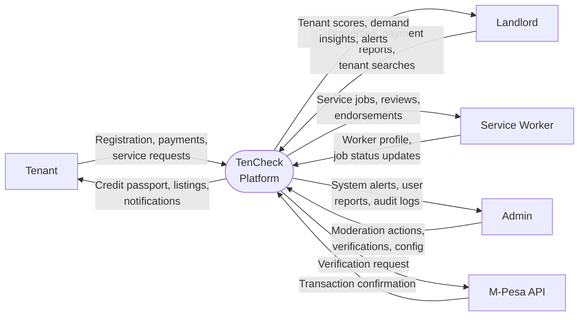
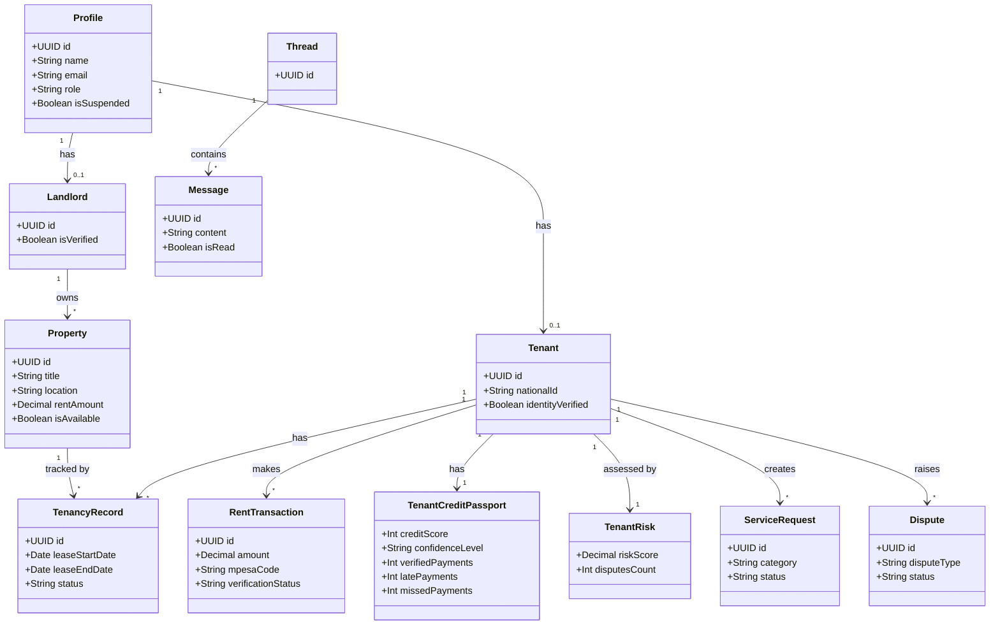
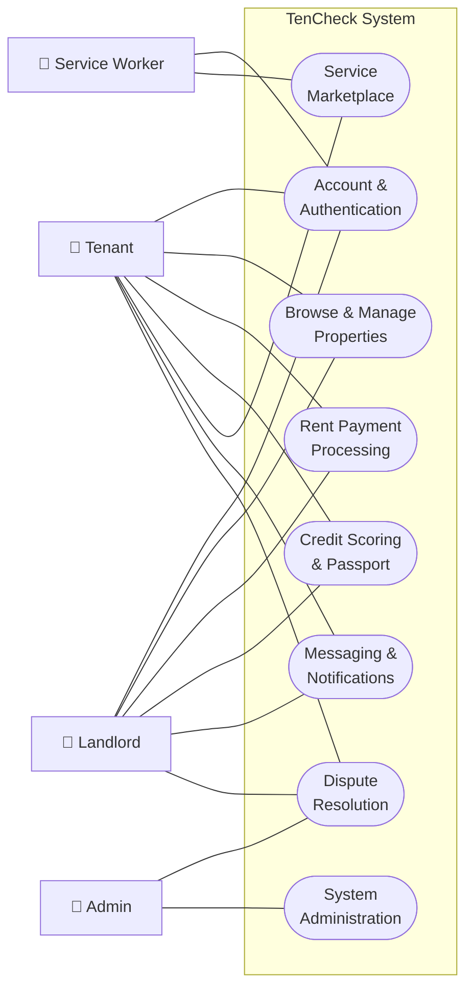

# TenCheck — Complete Documentation

> **Know Your Tenant Before You Hand Over the Keys**

TenCheck is a rental verification and tenant reputation platform purpose-built for Kenya's rental market. It bridges the trust gap between landlords and tenants by providing verified payment histories, data-driven reliability scores, a rental marketplace, dispute resolution, and a service-worker marketplace — all in one platform.

---

## Table of Contents

1. [Overview](#1-overview)
2. [User Roles](#2-user-roles)
3. [Features](#3-features)
   - [Tenant Features](#31-tenant-features)
   - [Landlord Features](#32-landlord-features)
   - [Service Worker Features](#33-service-worker-features)
   - [Cross-Cutting Features](#34-cross-cutting-features)
4. [Tech Stack](#4-tech-stack)
5. [Architecture](#5-architecture)
6. [Database Schema](#6-database-schema)
7. [Authentication](#7-authentication)
8. [Dashboard Guide](#8-dashboard-guide)
   - [Tenant Dashboard](#81-tenant-dashboard)
   - [Landlord Dashboard](#82-landlord-dashboard)
   - [Service Worker Dashboard](#83-service-worker-dashboard)
   - [Admin Dashboard](#84-admin-dashboard)
9. [Diagrams](#9-diagrams)
   - [Data Flow Diagrams (DFD)](#91-data-flow-diagrams-dfd)
   - [UML Diagrams](#92-uml-diagrams)
   - [Use Case Diagrams](#93-use-case-diagrams)
10. [Project Structure](#10-project-structure)
11. [Pages & Routes](#11-pages--routes)
12. [Environment Variables](#12-environment-variables)
13. [Local Development Setup](#13-local-development-setup)
14. [Scripts Reference](#14-scripts-reference)

---

## 1. Overview

Kenya's rental market faces a persistent problem: **landlords cannot easily verify a prospective tenant's payment reliability**, and **tenants have no portable, verifiable record** of their rent payment history.

TenCheck solves this by:

- Giving **tenants** a portable **Credit Passport** — a verifiable record of rent payments, reliability score, and financial behaviour — that they can share with any landlord.
- Giving **landlords** a real-time **tenant screening tool** — search any tenant by national ID or phone number to see their score, verified payment history, and risk profile.
- Providing a **rental marketplace** where tenants can browse verified listings and landlords can attract better-qualified renters.
- Offering **AI-powered matching** to rank applicants by creditworthiness and recommend properties by affordability.
- Enabling **dispute resolution** for payment and tenancy conflicts.
- Including a **service-worker marketplace** for verified maintenance and repair professionals.

---

## 2. User Roles

| Role | Description |
|---|---|
| **Tenant** | Rents properties. Builds a credit passport from verified M-Pesa payments. Browses listings, requests services, and applies for micro-financing. |
| **Landlord** | Lists properties, screens tenants, records payments, manages disputes, endorses service workers, and views market demand insights. |
| **Service Worker** | Accepts service requests (plumbing, electrical, etc.), builds a verified reputation through reviews and endorsements. |
| **Admin** | Manages platform users, moderates content, reviews verification requests, and monitors system health. |

Role is selected at registration and stored in the user's `profile.role` field. Each role gets a different dashboard experience.

---

## 3. Features

### 3.1 Tenant Features

#### Credit Passport
The Credit Passport is the core value proposition for tenants. It is a portable, shareable financial profile built from verified payment data.

- **Score (0–100)** — Composite reliability score computed by the `calculate_credit_passport` database function.
- **Confidence Level** — High / Medium / Low, based on the volume of verified data available.
- **Stats Shown**: Verified payments count, late payments count, missed payments count, services completed.
- **Payment Timeline** — Visual history of rent payments, each shown with a status icon (on-time, late, missed).
- **Shareable Link** — Tenants can generate a public link (`/passport/:tenantId`) to share their passport with any landlord without requiring them to sign up.

#### Property Browsing
- Searchable, filterable rental marketplace.
- Filters: rent range, location, number of bedrooms/bathrooms.
- View individual property detail pages with photos, description, and landlord contact.

#### AI Property Recommendations
- Personalised property suggestions based on the tenant's credit profile and stated preferences.
- Powered by the `AIMatchPanel` component.

#### Rent Payment Recording
- Record payments made via **M-Pesa**, **bank transfer**, or **wallet**.
- Upload M-Pesa SMS screenshots or confirmation messages as payment proof (`payment_evidence` table).
- Payments are reviewed and marked as verified, feeding directly into the Credit Passport score.

#### Digital Wallet
- Prepaid wallet stored in the `tenant_wallets` table.
- Deposit funds and use them to pay rent directly through the platform.

#### Service Credits
- Purchase and use service credits for booking maintenance and repair jobs.
- Balance tracked in the `user_service_credits` table.

#### Financing Requests
- Apply for emergency micro-financing through the `FinancialRequestPanel`.
- Applications stored in the `financial_requests` table with a review workflow.

#### Risk Score
- View your own risk score — the same score landlords see when they screen you.
- Computed from disputes, late payments, and missed payments via `calculate_tenant_risk`.

#### Trust Network
- Build social trust connections with other users.
- Connections stored in the `trust_network` table with weighted relationships.

#### Service Requests
- Book verified service workers for maintenance tasks.
- Categories include plumbing, electrical, carpentry, cleaning, and more.
- Track job status (pending → in_progress → completed).

#### Disputes
- Submit disputes against landlords or for payment disagreements.
- View dispute status and evidence in the `DisputeOverviewPanel`.

#### Inquiries
- Send inquiries about properties directly through the platform.
- Track inquiry status in the `inquiries` table.

---

### 3.2 Landlord Features

#### Tenant Screening
- Search for any tenant by **national ID** or **phone number**.
- Instantly view their reliability score, payment history, and risk profile.

#### Tenant Risk Assessment
- View a detailed risk breakdown: number of disputes, late payments, missed payments, computed risk score.
- Powered by the `TenantRiskPanel` component and `calculate_tenant_risk` database function.

#### AI Tenant Ranking
- Provide the AI with a list of applicants; it ranks them by creditworthiness and reliability.
- Powered by the `AIMatchPanel` in `mode="landlord"`.

#### Property Management
- List rental properties with title, description, location, number of bedrooms/bathrooms, rent amount, and images.
- Properties are stored in the `properties` table and appear in the tenant browse marketplace.

#### Rent Payment Tracking
- Record tenant rent payments and mark their verification status.
- View full payment history per tenant or per property.

#### Tenancy Records
- Create and manage tenancy records linking a tenant to a property with lease dates and payment status.
- Track active and completed tenancies in the `tenancy_records` table.

#### Demand Insights
- View market analytics: average rent in an area, vacancy rate, total searches.
- Data refreshed by the `refresh_property_demand` database function.

#### Dispute Management
- View and respond to disputes filed by tenants.
- Track dispute evidence and resolution status.

#### Worker Endorsements
- Endorse verified service workers from the `EndorseWorkerPanel`.
- Endorsements are stored in `worker_endorsements` and factor into the worker's rating.

#### Inquiries Management
- View and respond to tenant inquiries submitted about listed properties.

---

### 3.3 Service Worker Features

- **Profile & Verification** — Build a credibility profile with documents, skills, and availability.
- **Service Requests** — View and accept incoming job requests by category and location.
- **Ratings & Reviews** — Receive reviews from tenants and landlords after completing jobs.
- **Landlord Endorsements** — Get publicly visible endorsements from landlords.
- **Dedicated Dashboard** — The `/worker-dashboard` route provides a role-specific interface.

---

### 3.4 Cross-Cutting Features

#### Messaging System
- **Hub-and-spoke model**: conversations are thread-based, connecting tenants, landlords, and service workers.
- Threads are stored in the `threads` table; participants in `thread_participants`; individual messages in `messages`.
- **Real-time delivery** via Supabase Realtime subscriptions.
- Supports message attachments (`message_attachments` table).

#### Notifications
- Real-time platform notifications for inquiries, messages, payments, disputes, and service request updates.
- Stored in the `notifications` table.
- Displayed via the `NotificationsPanel` with a live bell indicator.

#### Admin Dashboard
- Accessible at `/admin` to users with the `admin` role.
- Manage users, suspend accounts (`is_suspended` flag on profiles), moderate content, review worker verifications, and view the moderation log.

---

## 4. Tech Stack

| Layer | Technology |
|---|---|
| **Frontend Framework** | React 18.3, TypeScript |
| **Build Tool** | Vite (with React SWC plugin) |
| **UI Components** | shadcn/ui (Radix UI primitives) |
| **Styling** | Tailwind CSS 3.4 |
| **Animations** | Framer Motion 12 |
| **State Management** | TanStack React Query 5 |
| **Routing** | React Router DOM 6 |
| **Forms & Validation** | React Hook Form 7 + Zod |
| **Backend & Database** | Supabase (PostgreSQL + Auth + Realtime) |
| **QR Codes** | qrcode.react |
| **Charts** | Recharts |
| **Date Utilities** | date-fns |
| **Icons** | Lucide React |
| **Toast Notifications** | Sonner |
| **Theme** | next-themes (dark/light mode) |
| **Testing** | Vitest |
| **Linting** | ESLint |

---

## 5. Architecture

### High-Level Diagram

```
┌─────────────────────────────────────────────────────┐
│                   User's Browser                    │
│                                                     │
│  ┌───────────────────────────────────────────────┐  │
│  │          React SPA (Vite, TypeScript)         │  │
│  │                                               │  │
│  │  ┌──────────┐  ┌──────────┐  ┌────────────┐  │  │
│  │  │  Pages   │  │Dashboard │  │ Components │  │  │
│  │  │ (Router) │  │  Panels  │  │  (shadcn)  │  │  │
│  │  └──────────┘  └──────────┘  └────────────┘  │  │
│  │                                               │  │
│  │  ┌──────────────────────┐  ┌───────────────┐  │  │
│  │  │  React Query Cache   │  │ AuthContext   │  │  │
│  │  └──────────────────────┘  └───────────────┘  │  │
│  └───────────────────────────────────────────────┘  │
└──────────────────────────┬──────────────────────────┘
                           │ HTTPS / WebSocket
┌──────────────────────────▼──────────────────────────┐
│                  Supabase Platform                  │
│                                                     │
│  ┌───────────┐  ┌────────────┐  ┌────────────────┐  │
│  │  PostgREST│  │  Auth API  │  │   Realtime     │  │
│  │  (REST)   │  │ (JWT/Email)│  │  (WebSocket)   │  │
│  └─────┬─────┘  └─────┬──────┘  └───────┬────────┘  │
│        │              │                  │           │
│  ┌─────▼──────────────▼──────────────────▼────────┐  │
│  │               PostgreSQL Database              │  │
│  │  (30+ tables, RLS policies, triggers,          │  │
│  │   stored functions, 16 migrations)             │  │
│  └────────────────────────────────────────────────┘  │
│                                                     │
│  ┌──────────────────────────────────────────────┐   │
│  │           Supabase Storage (Buckets)         │   │
│  │  payment-evidence, avatars, property-images  │   │
│  └──────────────────────────────────────────────┘   │
└─────────────────────────────────────────────────────┘
```

### Data Flow

1. **User authenticates** via Supabase Auth (email + password).
2. A JWT session is stored in `localStorage` and auto-refreshed by the Supabase client.
3. The `AuthContext` fetches the user's `profile` row (including `role`) and makes it available globally.
4. **Pages and components** use `@tanstack/react-query` (`useQuery`, `useMutation`) to read/write data through the typed Supabase client.
5. **Realtime subscriptions** (`supabase.channel`) push live updates for messages, notifications, and service request status changes without polling.
6. **File uploads** (payment evidence, avatars, property images) go directly to Supabase Storage buckets.
7. **Score computation** is handled server-side by PostgreSQL stored functions (`calculate_credit_passport`, `calculate_tenant_risk`, `calculate_tenant_score`) triggered on demand.

### Key Architectural Patterns

| Pattern | Usage |
|---|---|
| **Role-Based UI** | Dashboard tabs and page access are filtered by `profile.role` |
| **Row Level Security (RLS)** | Every table has RLS policies so users can only read/write their own data |
| **Lazy Loading** | All pages except `Index`, `Login`, and `Signup` are code-split with `React.lazy` + `Suspense` |
| **Optimistic Updates** | React Query mutations update the UI before the server confirms |
| **Real-time Subscriptions** | `supabase.channel().on('postgres_changes')` drives live messaging and notifications |
| **Type Safety** | Full end-to-end TypeScript types generated from the Supabase schema (`types.ts`) |

---

## 6. Database Schema

The database is a PostgreSQL instance managed by Supabase, defined across **16 migration files**.

### User Management

| Table | Key Columns | Purpose |
|---|---|---|
| `profiles` | `id`, `user_id`, `name`, `email`, `phone`, `role`, `avatar_url`, `is_suspended` | Core user profile for all roles |
| `user_roles` | `user_id`, `role` (enum: admin/moderator/user) | Admin role assignments |
| `tenants` | `id`, `user_id`, `national_id`, `phone`, `full_name`, `date_of_birth`, `identity_verified` | Tenant-specific identity data |
| `landlords` | `id`, `user_id`, `is_verified` | Landlord accounts |
| `landlord_profiles` | `landlord_id`, `total_properties`, `avg_rating` | Extended landlord metrics |
| `landlord_verification` | `landlord_id`, `document_type`, `document_url`, `verification_status` | KYC document verification |

### Properties & Rentals

| Table | Key Columns | Purpose |
|---|---|---|
| `properties` | `id`, `landlord_id`, `title`, `location`, `bedrooms`, `bathrooms`, `rent_amount`, `images`, `is_available` | Rental listings |
| `inquiries` | `id`, `tenant_id`, `property_id`, `message`, `status` | Tenant enquiries on properties |
| `rental_records` | `id`, `tenant_id`, `landlord_id`, `property_id`, `start_date`, `end_date`, `payment_status` | Historical rental records |
| `tenancy_records` | `id`, `tenant_id`, `landlord_id`, `property_id`, `lease_start_date`, `lease_end_date`, `status` | Active/past tenancies |
| `tenancy_reviews` | `reviewer_id`, `reviewee_id`, `rating`, `comment` | Post-tenancy ratings |
| `property_demand` | `location`, `average_rent`, `vacancy_rate`, `total_searches` | Market demand metrics |

### Financial

| Table | Key Columns | Purpose |
|---|---|---|
| `rent_transactions` | `id`, `tenant_id`, `landlord_id`, `amount`, `payment_method`, `mpesa_code`, `verification_status` | Rent payment records |
| `payment_evidence` | `id`, `tenant_id`, `transaction_id`, `evidence_type`, `evidence_url`, `status` | Uploaded payment proof |
| `tenant_wallets` | `tenant_id`, `balance` | Prepaid digital wallet |
| `financial_requests` | `id`, `tenant_id`, `amount_requested`, `reason`, `status` | Micro-financing applications |
| `user_service_credits` | `user_id`, `balance` | Platform service credits |
| `service_credit_purchases` | `user_id`, `amount`, `credits_purchased` | Credit purchase history |

### Credit & Risk Scoring

| Table | Key Columns | Purpose |
|---|---|---|
| `tenant_credit_passport` | `tenant_id`, `credit_score`, `confidence_level`, `verified_payments`, `late_payments`, `missed_payments` | Computed credit passport |
| `tenant_scores` | `tenant_id`, `score`, `verified_payments`, `late_payments`, `missed_payments` | Raw score data |
| `tenant_risk` | `tenant_id`, `risk_score`, `disputes_count`, `late_payments_count`, `missed_payments_count` | Risk assessment |

### Stored Functions (Score Computation)

| Function | Description |
|---|---|
| `calculate_credit_passport(tenant_id)` | Computes and upserts the credit passport for a tenant |
| `calculate_tenant_risk(tenant_id)` | Computes and upserts the risk assessment for a tenant |
| `calculate_tenant_score(tenant_id)` | Computes and upserts the raw reliability score |
| `find_or_create_tenant(...)` | Looks up or creates a tenant record |
| `has_role(user_id, role)` | Checks if a user has a given admin role |
| `is_thread_participant(thread_id, user_id)` | Verifies messaging permission |
| `refresh_property_demand()` | Recalculates market demand metrics |

### Services & Workers

| Table | Key Columns | Purpose |
|---|---|---|
| `service_workers` | `id`, `user_id`, `category`, `is_verified` | Service worker accounts |
| `service_worker_profiles` | `worker_id`, `bio`, `rating`, `availability`, `is_verified` | Extended worker profiles |
| `service_requests` | `id`, `tenant_id`, `worker_id`, `category`, `location`, `status`, `deposit_amount` | Service job requests |
| `service_request_deposits` | `request_id`, `amount`, `status` | Deposits held per request |
| `worker_complaints` | `complainant_id`, `worker_id`, `description`, `status` | Complaints against workers |
| `worker_endorsements` | `landlord_id`, `worker_id`, `comment` | Landlord endorsements |
| `worker_reviews` | `reviewer_id`, `worker_id`, `rating`, `comment` | Post-job reviews |

### Messaging & Communication

| Table | Key Columns | Purpose |
|---|---|---|
| `threads` | `id`, `tenant_id`, `landlord_id`, `service_worker_id`, `property_id` | Conversation threads |
| `thread_participants` | `thread_id`, `user_id`, `role` | Thread membership |
| `messages` | `id`, `thread_id`, `sender_id`, `content`, `is_read`, `created_at` | Individual messages |
| `message_attachments` | `message_id`, `file_url`, `file_type` | File attachments |
| `notifications` | `id`, `user_id`, `title`, `body`, `is_read`, `type` | Platform notifications |

### Trust & Disputes

| Table | Key Columns | Purpose |
|---|---|---|
| `trust_network` | `from_user_id`, `to_user_id`, `weight`, `relation_type` | Trust relationships |
| `disputes` | `id`, `raised_by`, `against`, `dispute_type`, `status`, `evidence_url` | Payment/tenancy disputes |
| `review_disputes` | `review_id`, `disputed_by`, `reason`, `status` | Disputed review appeals |

### Administration

| Table | Key Columns | Purpose |
|---|---|---|
| `admin_alerts` | `id`, `type`, `message`, `resolved` | System health alerts for admins |
| `moderation_log` | `id`, `admin_id`, `action`, `target_id`, `notes` | Audit trail of admin actions |

---

## 7. Authentication

Authentication is handled by **Supabase Auth** with email/password as the primary method.

### Sign-Up Flow

```
User submits: email, password, name, phone, role (tenant | landlord)
        ↓
supabase.auth.signUp({ email, password, options: { data: { name, phone, role } } })
        ↓
Supabase creates auth.users record
        ↓
Database trigger: handle_new_user()
  → Inserts a row into public.profiles with user_id, name, email, phone, role
        ↓
AuthContext fetches profile → stored in React Context
        ↓
User redirected to /dashboard
```

### Sign-In Flow

```
User submits: email, password
        ↓
supabase.auth.signInWithPassword({ email, password })
        ↓
Returns Session (JWT access token + refresh token)
        ↓
Session persisted to localStorage (auto-refreshed by Supabase client)
        ↓
AuthContext fetches profile from public.profiles
        ↓
User redirected to /dashboard
```

### Sign-Out Flow

```
supabase.auth.signOut()
        ↓
AuthContext clears session and profile state
        ↓
User redirected to /
```

### Session Recovery

On every page load, the Supabase client checks `localStorage` for an existing session and calls `onAuthStateChange` to restore it. The `AuthContext` responds to these events and hydrates the global state.

### Context API

The `AuthContext` exposes the following to any component in the tree:

```typescript
interface AuthContextType {
  session: Session | null;      // Supabase session (JWT)
  user: User | null;            // Supabase auth user
  profile: Profile | null;      // App profile (name, role, phone, etc.)
  loading: boolean;             // True while session is being restored
  signUp: (email, password, metadata) => Promise<{ error }>;
  signIn: (email, password) => Promise<{ error }>;
  signOut: () => Promise<void>;
}
```

### Row Level Security (RLS)

Every table in the database has RLS policies enabled. Policies are defined in the migration files and enforced by PostgreSQL, ensuring:

- Users can only read their own `profile`, `wallet`, `financial_requests`, etc.
- Landlords can only modify properties they own.
- Message thread access is gated by the `is_thread_participant` function.
- Admin actions require the `has_role(user_id, 'admin')` check.

---

## 8. Dashboard Guide

The dashboard (`/dashboard`) is the central hub of the application. It uses a **responsive sidebar-and-tab layout** with role-specific navigation.

### Layout Structure

```
┌─────────────────────────────────────────────────────┐
│  Header: hamburger | page title | notification bell  │
├─────────────────┬───────────────────────────────────┤
│  Sidebar        │                                   │
│  ─────────      │   Active Tab Content              │
│  Logo           │                                   │
│  User Avatar    │   (panel component rendered       │
│  User Name      │    based on activeTab state)      │
│  User Role      │                                   │
│                 │                                   │
│  Navigation     │                                   │
│  Tabs (list)    │                                   │
│                 │                                   │
│  Sign Out       │                                   │
└─────────────────┴───────────────────────────────────┘
```

On mobile, the sidebar collapses into a slide-in drawer triggered by the hamburger button.

---

### 8.1 Tenant Dashboard

| Tab | Component | Description |
|---|---|---|
| **Browse Houses** | Inline | Searchable/filterable property marketplace |
| **Messages** | `MessagingHub` | Thread-based conversations with landlords & workers |
| **Notifications** | `NotificationsPanel` | Real-time alerts with mark-as-read |
| **My Tenancies** | `TenancyManager` | Current and past tenancy records |
| **AI Matches** | `AIMatchPanel` (mode=tenant) | Personalised property recommendations |
| **Credit Passport** | `CreditPassportCard` | Score gauge, stats, payment timeline, confidence badge |
| **Share Passport** | `SharePassport` | Generate and copy shareable passport link |
| **Pay Rent** | `RentPaymentPanel` | Record M-Pesa / wallet / bank payments |
| **Wallet** | Inline | View balance, deposit funds |
| **Financing** | `FinancialRequestPanel` | Apply for micro-financing |
| **Service Credits** | `ServiceCreditsPanel` | Buy and use platform service credits |
| **Upload Proof** | `ImageUpload` | Upload M-Pesa SMS or screenshots |
| **My Score** | Inline | Detailed score breakdown |
| **My Risk Score** | `TenantRiskPanel` | Risk profile as seen by landlords |
| **Trust Network** | `TrustNetworkPanel` | Social connections and endorsements |
| **Services** | `ServiceRequestPanel` | Book and track maintenance/repair jobs |
| **Report Worker** | `WorkerComplaintsPanel` | File a complaint against a service worker |
| **My Disputes** | `DisputeOverviewPanel` (role=tenant) | View and manage disputes |
| **My Inquiries** | Inline | Inquiries submitted about properties |
| **My Profile** | Link to `/my-profile` | Full profile editor |

---

### 8.2 Landlord Dashboard

| Tab | Component | Description |
|---|---|---|
| **My Properties** | Inline | List, add, edit, and remove rental listings |
| **Messages** | `MessagingHub` | Thread-based conversations with tenants |
| **Notifications** | `NotificationsPanel` | Real-time alerts |
| **Tenancies** | `TenancyManager` (role=landlord) | Manage tenancy records |
| **Search Tenant** | Inline | Lookup tenant by national ID or phone |
| **AI Tenant Rank** | `AIMatchPanel` (mode=landlord) | Rank applicants by reliability |
| **Report Payment** | `RentPaymentPanel` (role=landlord) | Log tenant rent payments |
| **Payments** | Inline | Payment overview and transaction history |
| **Tenant Risk** | `TenantRiskPanel` | Risk assessment for searched tenants |
| **Demand Insights** | `PropertyDemandPanel` | Market demand by location |
| **Trust Network** | `TrustNetworkPanel` | Connections and endorsements |
| **Disputes** | `DisputeOverviewPanel` (role=landlord) | Manage tenant disputes |
| **Endorse Worker** | Inline | Endorse verified service workers |
| **Inquiries** | Inline | View and respond to property inquiries |

---

### 8.3 Service Worker Dashboard

Accessible at `/worker-dashboard`. Provides a role-specific interface for:

- Viewing and accepting incoming service requests.
- Managing job status (pending → in_progress → completed).
- Viewing reviews and ratings.
- Managing their service worker profile.

---

### 8.4 Admin Dashboard

Accessible at `/admin` (requires `admin` role in `user_roles` table). Provides:

- **User Management** — Search users, view profiles, suspend accounts.
- **Worker Verification** — Review and approve/reject service worker verification documents.
- **Moderation** — Review flagged content and disputes.
- **Audit Log** — View `moderation_log` entries.
- **Admin Alerts** — View system-generated alerts.

---

## 9. Diagrams

All diagrams are written as **Mermaid** code blocks and render natively on GitHub.

### 9.1 Data Flow Diagrams (DFD)

Full file: [`docs/dfd.md`](docs/dfd.md)

| Level | Description |
|---|---|
| **Level 0** (Context) | TenCheck as a single black-box; all external entities and high-level data flows |
| **Level 1** | 8 core processes + 7 data stores + all entity interactions |
| **Level 2** | Deep-dive into Process 3 (Payments), Process 4 (Credit Scoring), and Process 2 (Property Management) |
| **Level 3** | Step-by-step breakdown of the `calculate_credit_passport` stored function |

#### Level 0 — Context Diagram



---

### 9.2 UML Diagrams

Full file: [`docs/uml.md`](docs/uml.md)

| Diagram | Description |
|---|---|
| **Class Diagram** | All domain entities, attributes, and relationships |
| **Sequence — Registration & Sign-In** | Full auth flow through Supabase and DB trigger |
| **Sequence — Tenant Screening** | Landlord searches and views a tenant's profile |
| **Sequence — M-Pesa Payment** | Tenant records, uploads evidence, M-Pesa verified, score updated |
| **Sequence — Service Booking** | Tenant creates request; worker accepts; real-time updates |
| **Sequence — Dispute Resolution** | Tenant files → landlord responds → admin resolves |
| **Activity — Sign-Up Flow** | Step-by-step registration with role branching |
| **Activity — Credit Score Calculation** | Formula, confidence levels, database upsert |
| **Component Diagram** | Frontend modules ↔ Supabase services |
| **Deployment Diagram** | Browser → CDN → Supabase Cloud → PostgreSQL |

#### Class Diagram (core entities)



---

### 9.3 Use Case Diagrams

Full file: [`docs/usecases.md`](docs/usecases.md)

| Diagram | Description |
|---|---|
| **System Overview** | All actors and feature areas at a glance |
| **Tenant** | 28 use cases: auth, properties, payments, passport, services, social |
| **Landlord** | 22 use cases: auth, property mgmt, tenant mgmt, payments, comms |
| **Service Worker** | 13 use cases: auth, job management, reputation, comms |
| **Admin** | 14 use cases: user mgmt, verification, moderation, monitoring |
| **Dispute Resolution** | Cross-actor flow: Tenant → Landlord → Admin |
| **Rent Payment Verification** | Cross-actor flow: Tenant → M-Pesa API → Credit Score |

#### System Overview



---

## 10. Project Structure

```
tencheck/
├── public/
│   ├── favicon.ico
│   └── robots.txt
│
├── src/
│   ├── App.tsx                    # Root component: providers + router + lazy routes
│   ├── main.tsx                   # React entry point (ReactDOM.createRoot)
│   ├── index.css                  # Global styles (Tailwind base + custom)
│   │
│   ├── pages/                     # One file per route
│   │   ├── Index.tsx              # Landing page
│   │   ├── Login.tsx              # Sign-in form
│   │   ├── Signup.tsx             # Registration form
│   │   ├── ForgotPassword.tsx     # Password reset request
│   │   ├── ResetPassword.tsx      # Password reset completion
│   │   ├── AccountSettings.tsx    # Account configuration
│   │   ├── Dashboard.tsx          # Main app hub (role-based tabbed dashboard)
│   │   ├── AdminDashboard.tsx     # Admin panel
│   │   ├── ServiceWorkerDashboard.tsx  # Service worker interface
│   │   ├── Properties.tsx         # Rental marketplace
│   │   ├── PropertyDetail.tsx     # Individual property view
│   │   ├── Services.tsx           # Service marketplace
│   │   ├── TenantProfilePage.tsx  # Full tenant profile editor
│   │   ├── PassportPublic.tsx     # Public shareable credit passport
│   │   ├── AdminWorkerPanel.tsx   # Admin worker management
│   │   └── NotFound.tsx           # 404 page
│   │
│   ├── components/
│   │   ├── dashboard/             # 17 dashboard feature panels
│   │   │   ├── TenantProfile.tsx
│   │   │   ├── CreditPassportCard.tsx
│   │   │   ├── RentPaymentPanel.tsx
│   │   │   ├── ServiceRequestPanel.tsx
│   │   │   ├── ServiceCreditsPanel.tsx
│   │   │   ├── FinancialRequestPanel.tsx
│   │   │   ├── TenantRiskPanel.tsx
│   │   │   ├── PropertyDemandPanel.tsx
│   │   │   ├── TrustNetworkPanel.tsx
│   │   │   ├── DisputeOverviewPanel.tsx
│   │   │   ├── SharePassport.tsx
│   │   │   ├── AIMatchPanel.tsx
│   │   │   ├── MessagingHub.tsx
│   │   │   ├── NotificationsPanel.tsx
│   │   │   ├── TenancyManager.tsx
│   │   │   ├── WorkerComplaintsPanel.tsx
│   │   │   └── ImageUpload.tsx
│   │   │
│   │   ├── landing/               # Landing page sections
│   │   │   ├── Navbar.tsx         # Fixed top nav with auth state
│   │   │   ├── HeroSection.tsx    # Hero image, tagline, CTAs
│   │   │   ├── FeaturesSection.tsx # Feature highlight cards
│   │   │   ├── HowItWorksSection.tsx # 3-step explainer
│   │   │   └── Footer.tsx         # Footer links
│   │   │
│   │   ├── ui/                    # shadcn/ui reusable components
│   │   │   ├── button.tsx
│   │   │   ├── card.tsx
│   │   │   ├── input.tsx
│   │   │   ├── dialog.tsx
│   │   │   ├── tabs.tsx
│   │   │   ├── badge.tsx
│   │   │   └── ... (40+ components)
│   │   │
│   │   └── PasswordStrengthIndicator.tsx
│   │
│   ├── contexts/
│   │   └── AuthContext.tsx        # Auth state: session, user, profile, sign in/up/out
│   │
│   ├── hooks/
│   │   ├── use-toast.ts           # Sonner toast hook
│   │   └── use-mobile.tsx         # Viewport width breakpoint hook
│   │
│   ├── lib/
│   │   └── utils.ts               # cn() class merging utility
│   │
│   └── integrations/
│       └── supabase/
│           ├── client.ts          # Typed Supabase client instance
│           └── types.ts           # Auto-generated DB TypeScript types (1636 lines)
│
├── supabase/
│   └── migrations/                # 16 SQL migration files
│       ├── 20260308124857_...     # Initial schema
│       ├── 20260308172015_...     # Service workers
│       ├── 20260308172024_...     # RLS policy fixes
│       ├── 20260308181434_...     # Tenant fields expansion
│       ├── 20260308190905_...     # Rent transactions
│       ├── 20260308192959_...     # Credit passport
│       ├── 20260308194703_...     # Tenant risk
│       ├── 20260309151923_...     # Service worker profiles
│       ├── 20260310143111_...     # (Structural)
│       ├── 20260310144134_...     # Messaging system
│       ├── 20260310144146_...     # RLS policy fixes
│       ├── 20260311113759_...     # Thread RLS recursion fix
│       ├── 20260312211431_...     # Profiles SELECT restriction
│       ├── 20260312213456_...     # Add is_suspended to profiles
│       ├── 20260314203312_...     # Landlord verification
│       └── 20260315202725_...     # Remove hardcoded admin email
│
├── index.html                     # Vite HTML entry point
├── vite.config.ts                 # Vite config (port 8080, path alias @/)
├── tailwind.config.ts             # Tailwind theme extensions
├── tsconfig.json                  # TypeScript compiler config
├── tsconfig.app.json              # App-specific TS config
├── tsconfig.node.json             # Node/Vite TS config
├── eslint.config.js               # ESLint rules
├── postcss.config.js              # PostCSS (Tailwind + Autoprefixer)
├── components.json                # shadcn/ui configuration
├── package.json                   # Dependencies and scripts
├── package-lock.json              # Dependency lock file
└── README.md                      # Quick-start guide
```

---

## 11. Pages & Routes

| Route | Page | Access | Description |
|---|---|---|---|
| `/` | `Index` | Public | Landing page with hero, features, how it works |
| `/login` | `Login` | Public | Sign-in form |
| `/signup` | `Signup` | Public | Registration form (with role selection) |
| `/forgot-password` | `ForgotPassword` | Public | Request password reset email |
| `/reset-password` | `ResetPassword` | Public | Set new password via reset link |
| `/account-settings` | `AccountSettings` | Auth | Change email, password, and preferences |
| `/properties` | `Properties` | Public | Browse all rental listings |
| `/properties/:id` | `PropertyDetail` | Public | View a specific property |
| `/services` | `Services` | Auth | Browse and book service workers |
| `/dashboard` | `Dashboard` | Auth | Role-based main app hub |
| `/worker-dashboard` | `ServiceWorkerDashboard` | Auth (worker) | Service worker interface |
| `/my-profile` | `TenantProfilePage` | Auth (tenant) | Full tenant profile editor |
| `/passport/:tenantId` | `PassportPublic` | Public | Shareable credit passport view |
| `/admin` | `AdminDashboard` | Auth (admin) | Platform administration panel |
| `*` | `NotFound` | Public | 404 error page |

> Pages other than `Index`, `Login`, and `Signup` are **lazy-loaded** for performance.

---

## 12. Environment Variables

Create a `.env` file in the repository root with the following variables:

```env
# Your Supabase project ID
VITE_SUPABASE_PROJECT_ID=your_project_id

# Your Supabase project's anon/public key
VITE_SUPABASE_PUBLISHABLE_KEY=your_anon_key

# Your Supabase project URL
VITE_SUPABASE_URL=https://your_project_id.supabase.co
```

> **Where to find these**: In your [Supabase Dashboard](https://supabase.com/dashboard) → Project → Settings → API.

> **Security note**: The `VITE_SUPABASE_PUBLISHABLE_KEY` is the **anon/public** key. It is safe to expose in the browser. Row Level Security policies on the database enforce data access controls. Never commit a service role key to the frontend.

---

## 13. Local Development Setup

### Prerequisites

- **Node.js** v18 or higher
- **npm** v9 or higher
- A **Supabase project** (free tier is sufficient for development)

### Steps

1. **Clone the repository**

   ```bash
   git clone <YOUR_GIT_URL>
   cd tencheck
   ```

2. **Install dependencies**

   ```bash
   npm install
   ```

3. **Configure environment variables**

   ```bash
   cp .env.example .env   # or create .env manually
   # Fill in your Supabase project credentials
   ```

4. **Apply database migrations**

   Using the [Supabase CLI](https://supabase.com/docs/guides/cli):

   ```bash
   npx supabase login
   npx supabase link --project-ref <your-project-id>
   npx supabase db push
   ```

5. **Start the development server**

   ```bash
   npm run dev
   ```

   The app will be available at [http://localhost:8080](http://localhost:8080).

6. **Create a test user**

   - Navigate to `http://localhost:8080/signup`.
   - Register as a **Tenant** and as a **Landlord** in two separate accounts to test both dashboards.

---

## 14. Scripts Reference

| Script | Command | Description |
|---|---|---|
| **dev** | `npm run dev` | Start Vite dev server on port 8080 with HMR |
| **build** | `npm run build` | Production build (output: `dist/`) |
| **build:dev** | `npm run build:dev` | Development mode build |
| **preview** | `npm run preview` | Preview the production build locally |
| **lint** | `npm run lint` | Run ESLint across all source files |
| **test** | `npm run test` | Run tests once with Vitest |
| **test:watch** | `npm run test:watch` | Run tests in watch mode |

---

*Documentation generated for TenCheck — a Vite + React + TypeScript + Supabase application.*
