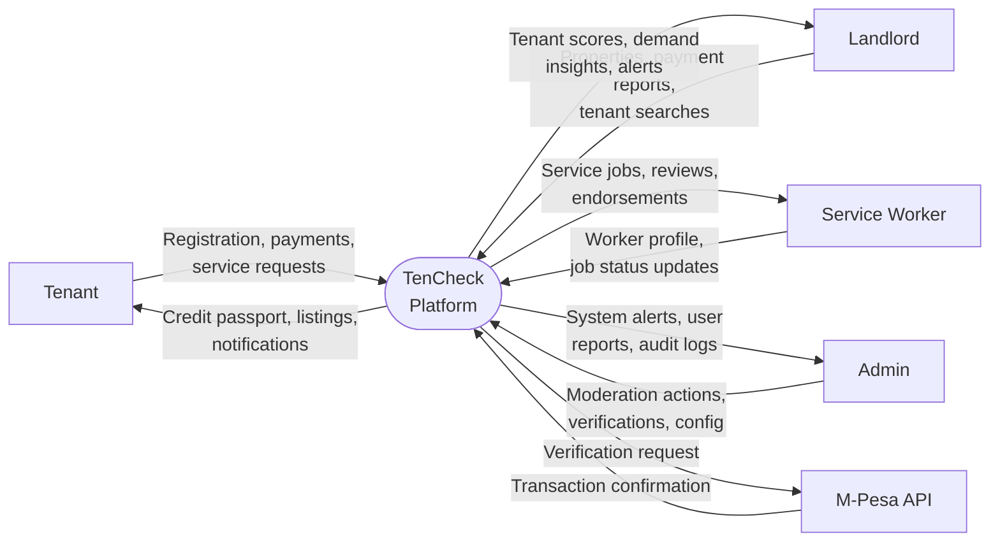
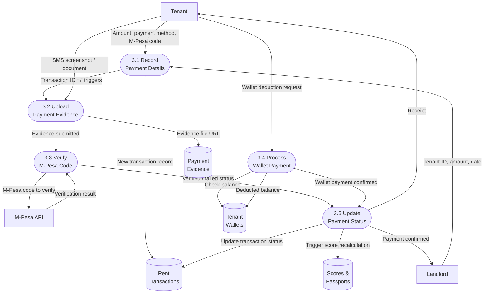
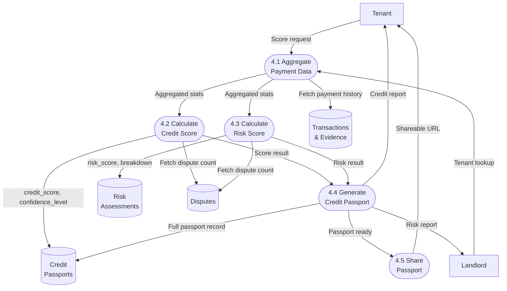
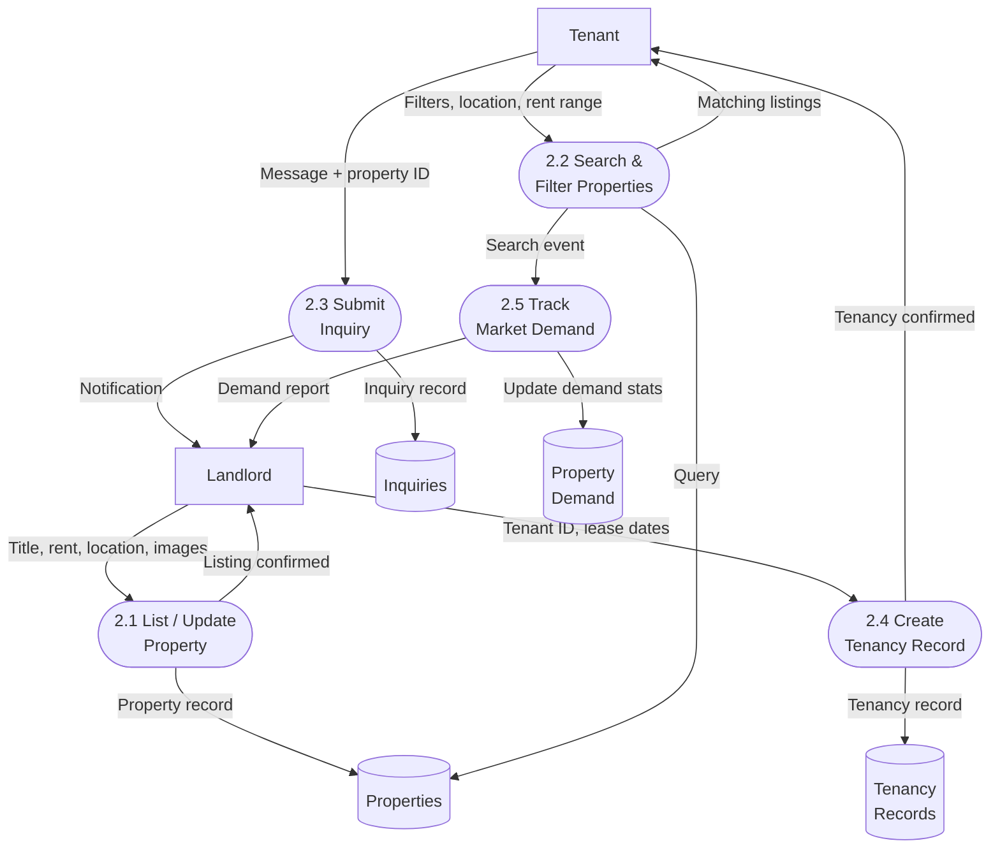
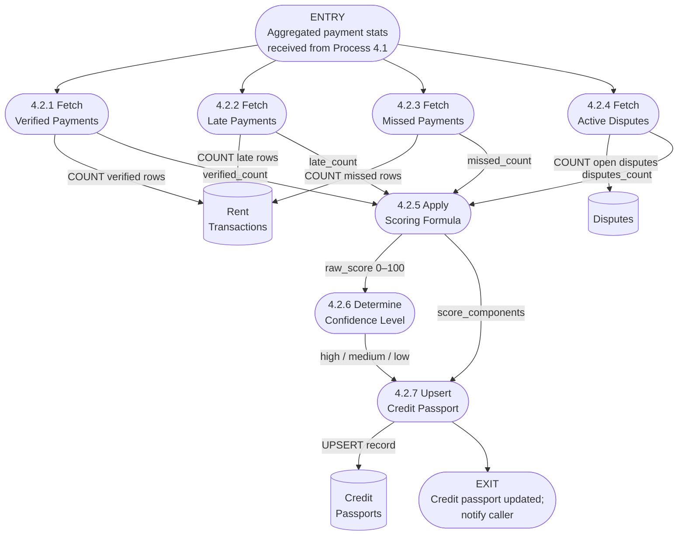

# TenCheck — Data Flow Diagrams (DFD)

DFDs use the Gane-Sarson notation adapted for Mermaid:

| Shape | Meaning |
|---|---|
| Rectangle `[ ]` | External entity (actor outside the system) |
| Stadium `([ ])` | Process (transforms data) |
| Cylinder `[( )]` | Data store (persistent storage) |
| Labelled arrow `-->` | Data flow (named data in motion) |

---

## Level 0 — Context Diagram

The context diagram treats TenCheck as a single black-box process and shows every external entity and the high-level data that flows in and out.



---

## Level 1 — Main Processes

Level 1 decomposes TenCheck into **8 core processes** and **7 data stores**, showing how each external entity interacts with the system and where data is persisted.

```mermaid
flowchart TB
    %% ── External entities ──────────────────────────────────────────────
    Tenant["Tenant"]
    Landlord["Landlord"]
    Worker["Service Worker"]
    Admin["Admin"]
    Mpesa["M-Pesa API"]

    %% ── Processes ───────────────────────────────────────────────────────
    P1(["1. User Auth\n& Profile Mgmt"])
    P2(["2. Property\nManagement"])
    P3(["3. Rent Payment\nProcessing"])
    P4(["4. Credit Scoring\nEngine"])
    P5(["5. Service\nMarketplace"])
    P6(["6. Messaging &\nNotifications"])
    P7(["7. Dispute\nResolution"])
    P8(["8. System\nAdministration"])

    %% ── Data stores ─────────────────────────────────────────────────────
    DS1[("DS1 · Profiles\n& Auth")]
    DS2[("DS2 · Properties\n& Tenancies")]
    DS3[("DS3 · Transactions\n& Evidence")]
    DS4[("DS4 · Scores\n& Passports")]
    DS5[("DS5 · Services\n& Workers")]
    DS6[("DS6 · Messages\n& Notifications")]
    DS7[("DS7 · Disputes\n& Audit Logs")]

    %% ── Entity → Process data flows ────────────────────────────────────
    Tenant   -->|"Sign-up / login"| P1
    Landlord -->|"Sign-up / login"| P1
    Worker   -->|"Sign-up / login"| P1

    Tenant   -->|"Browse, inquire"| P2
    Landlord -->|"List / manage properties"| P2

    Tenant   -->|"Payment details, M-Pesa code"| P3
    Landlord -->|"Report tenant payment"| P3
    Mpesa    -->|"Transaction confirmation"| P3

    Tenant   -->|"Request credit score"| P4
    Landlord -->|"Search tenant by ID/phone"| P4

    Tenant -->|"Create service request"| P5
    Worker -->|"Accept / update job"| P5

    Tenant   -->|"Send message"| P6
    Landlord -->|"Send message"| P6

    Tenant   -->|"File dispute"| P7
    Landlord -->|"Respond to dispute"| P7

    Admin -->|"Admin action / config"| P8

    %% ── Process → Entity data flows ────────────────────────────────────
    P1 -->|"Session token, profile"| Tenant
    P1 -->|"Session token, profile"| Landlord
    P1 -->|"Session token, profile"| Worker

    P2 -->|"Matching listings, inquiry status"| Tenant
    P2 -->|"Inquiry notification"| Landlord

    P3 -->|"Verify payment"| Mpesa
    P3 -->|"Receipt / wallet balance"| Tenant
    P3 -->|"Payment confirmed"| Landlord

    P4 -->|"Credit passport, risk score"| Tenant
    P4 -->|"Tenant risk report"| Landlord

    P5 -->|"Job details, status"| Worker
    P5 -->|"Worker matches, job status"| Tenant

    P6 -->|"Messages, notifications"| Tenant
    P6 -->|"Messages, notifications"| Landlord

    P7 -->|"Dispute outcome"| Tenant
    P7 -->|"Dispute outcome"| Landlord

    P8 -->|"Alerts, audit logs"| Admin

    %% ── Process ↔ Data store flows ──────────────────────────────────────
    P1 <-->|"read/write profiles"| DS1
    P2 <-->|"read/write listings"| DS2
    P3 <-->|"write transactions"| DS3
    P4 -->|"read transactions"| DS3
    P4 <-->|"read/write scores"| DS4
    P5 <-->|"read/write requests"| DS5
    P6 <-->|"read/write messages"| DS6
    P7 <-->|"read/write disputes"| DS7
    P8 <-->|"read/write all stores"| DS1
```



---

## Level 2 — Process Decomposition

### Level 2.1 — Process 3: Rent Payment Processing



---

### Level 2.2 — Process 4: Credit Scoring Engine



---

### Level 2.3 — Process 2: Property Management



---

## Level 3 — Credit Score Calculation (Process 4.2 Detail)

Process 4.2 is the most critical computation in TenCheck. Level 3 exposes the step-by-step logic inside the `calculate_credit_passport` PostgreSQL stored function.



### Scoring Formula (Process 4.2.5)

```
base_score   = (verified_count / max(total_payments, 1)) × 60
penalty      = (late_count × 5) + (missed_count × 15) + (disputes_count × 10)
credit_score = CLAMP(base_score - penalty + 40, 0, 100)

confidence_level:
  - HIGH   → total_payments ≥ 12
  - MEDIUM → total_payments ≥ 4
  - LOW    → total_payments < 4
```

---

## Summary: Process Inventory

| ID | Process | Key Inputs | Key Outputs |
|---|---|---|---|
| P1 | User Auth & Profile Mgmt | Credentials, user data | Session token, profile |
| P2 | Property Management | Listings, search queries, inquiries | Matched properties, tenancy records |
| P3 | Rent Payment Processing | Payment details, M-Pesa codes, evidence | Verified transactions, receipts |
| P4 | Credit Scoring Engine | Transaction history, disputes | Credit passport, risk score |
| P5 | Service Marketplace | Service requests, job updates | Job assignments, ratings |
| P6 | Messaging & Notifications | Messages, system events | Delivered messages, push notifications |
| P7 | Dispute Resolution | Dispute filings, evidence | Resolutions, outcomes |
| P8 | System Administration | Admin commands | Audit logs, moderation actions |
