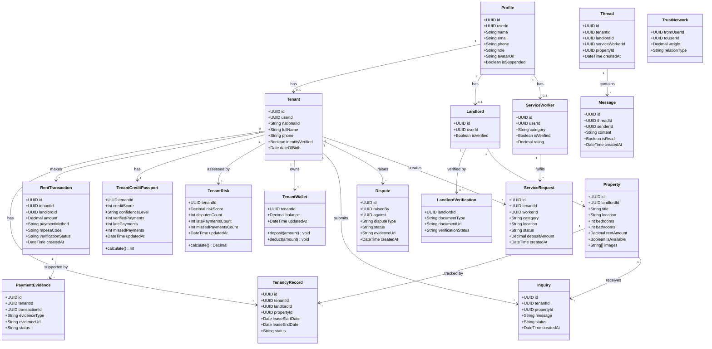
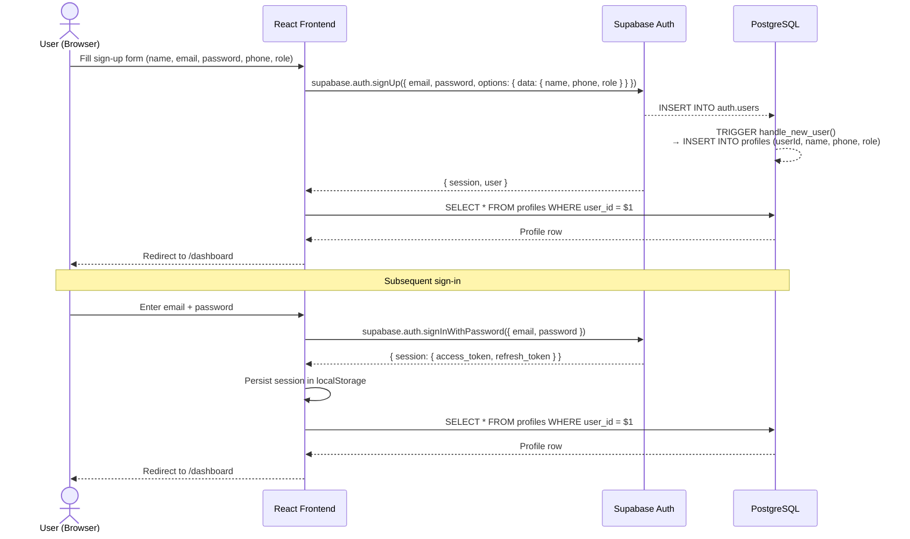
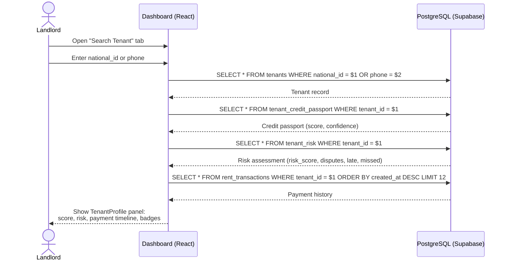
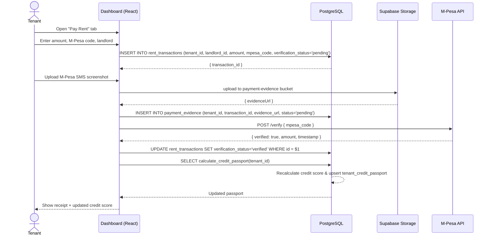
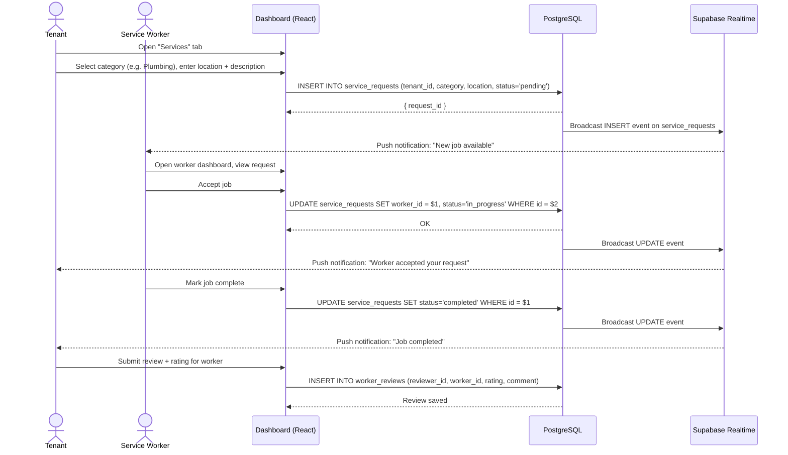
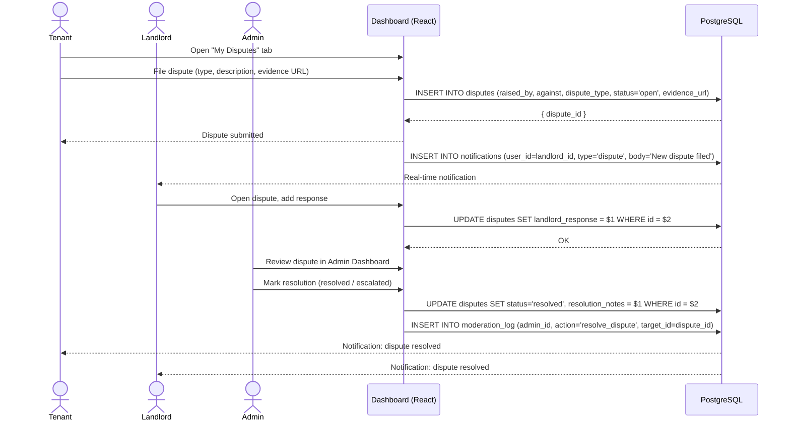
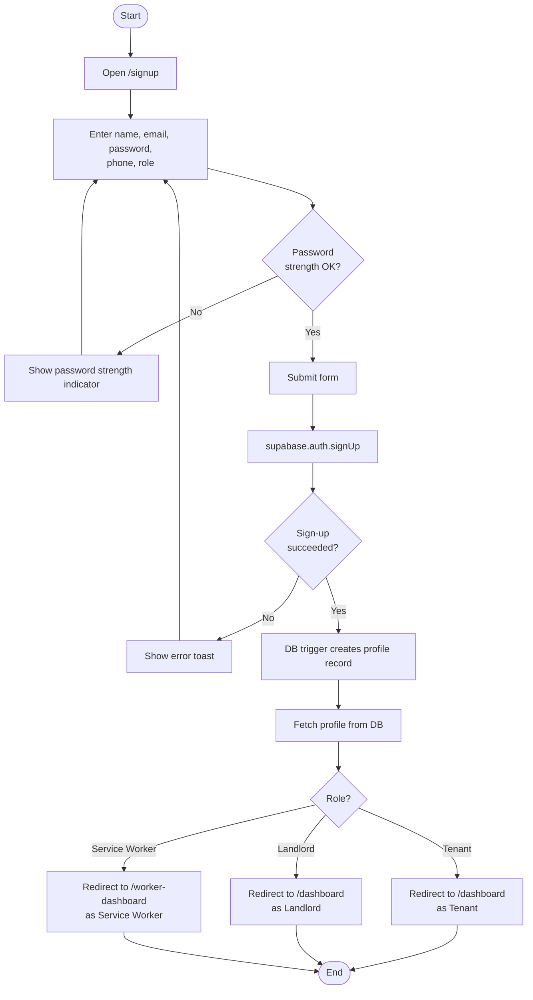
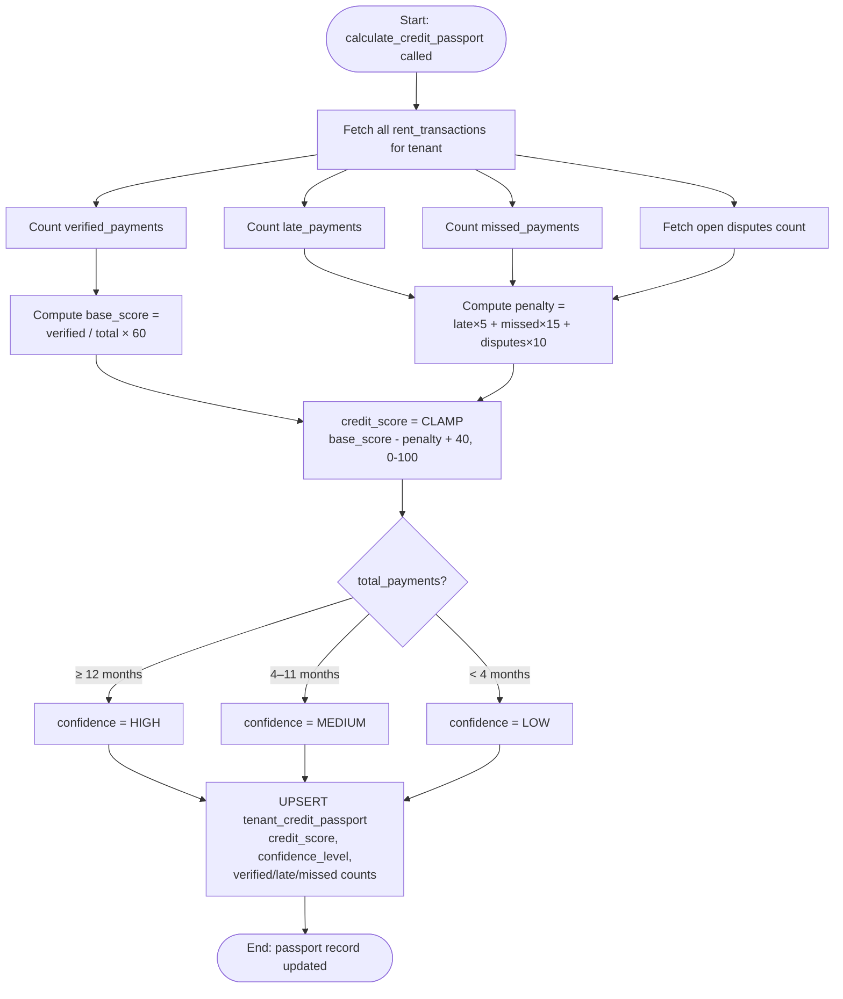
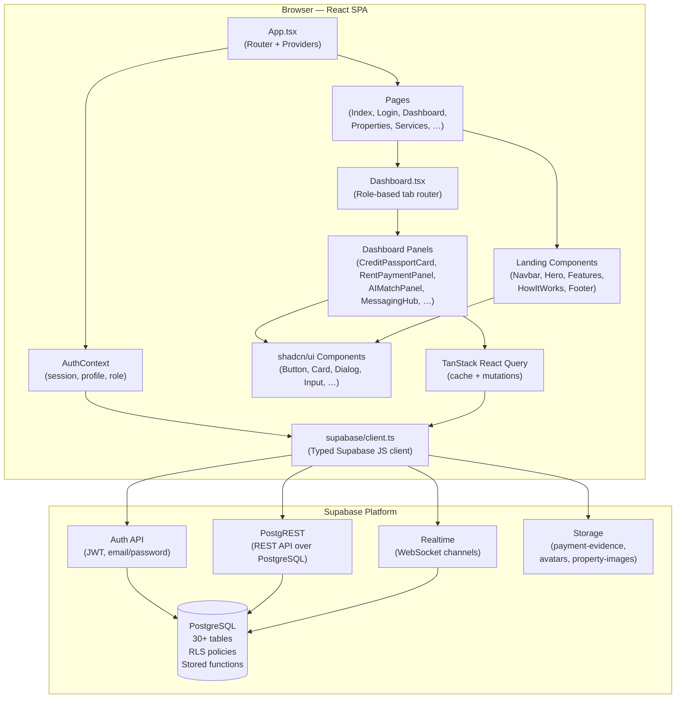
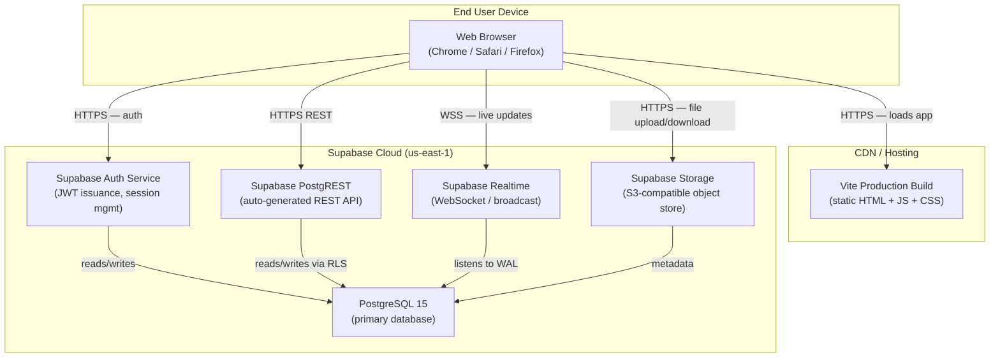

# TenCheck — UML Diagrams

---

## 1. Class Diagram

The class diagram shows the primary domain entities, their attributes, and relationships.

---

## 2. Sequence Diagrams

### 2.1 User Registration & Sign-In

---

### 2.2 Landlord Screens a Tenant

---

### 2.3 Tenant Records an M-Pesa Rent Payment

---

### 2.4 Tenant Books a Service Worker

---

### 2.5 Dispute Filing & Resolution

---

## 3. Activity Diagrams

### 3.1 User Sign-Up Flow

---

### 3.2 Credit Score Calculation Activity

---

## 4. Component Diagram

Shows how the main frontend modules depend on each other and on Supabase backend services.

---

## 5. Deployment Diagram

