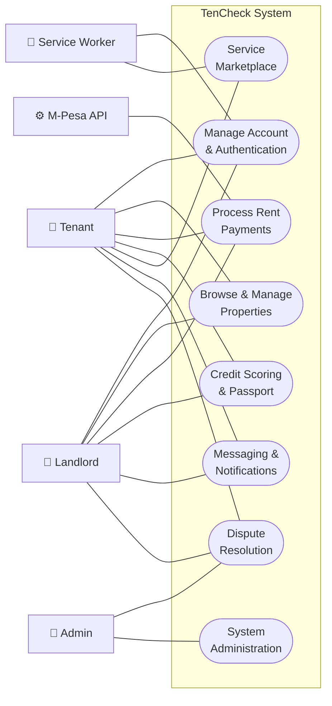
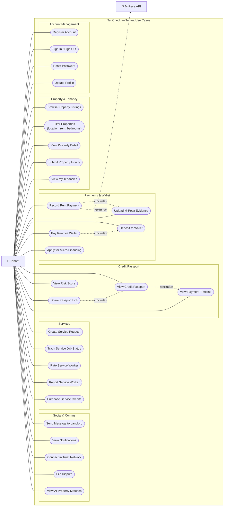
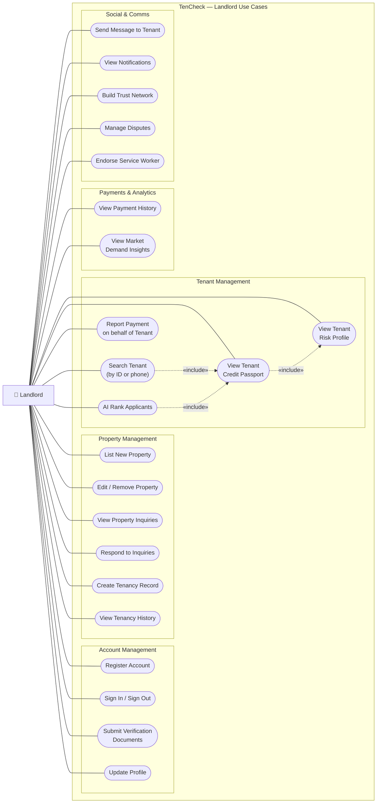
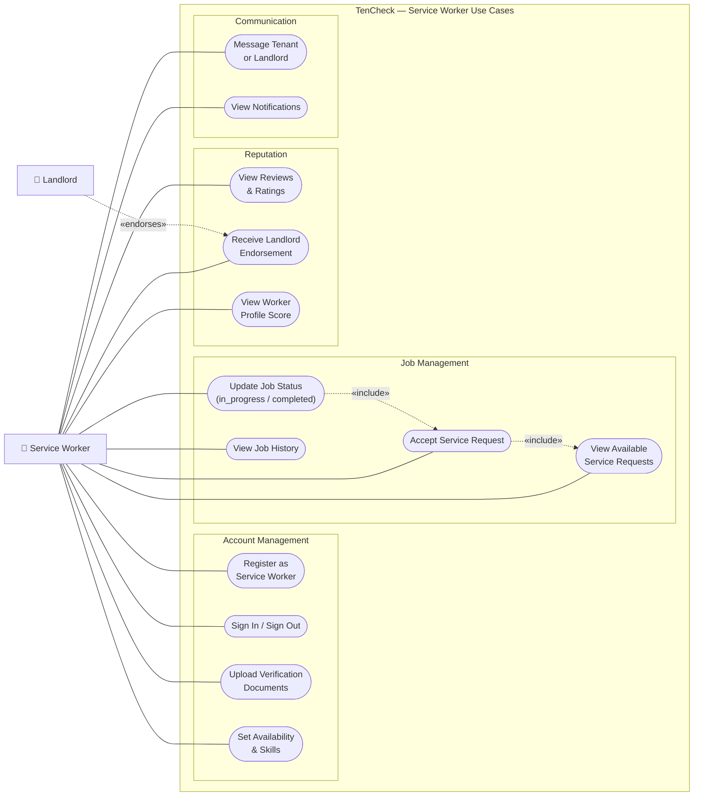
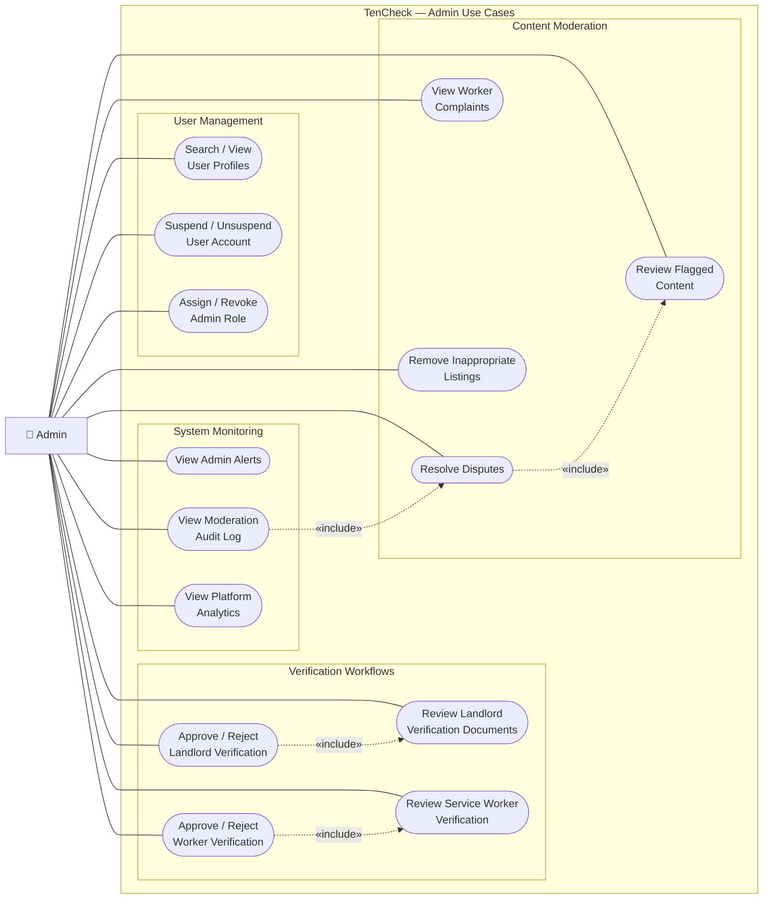
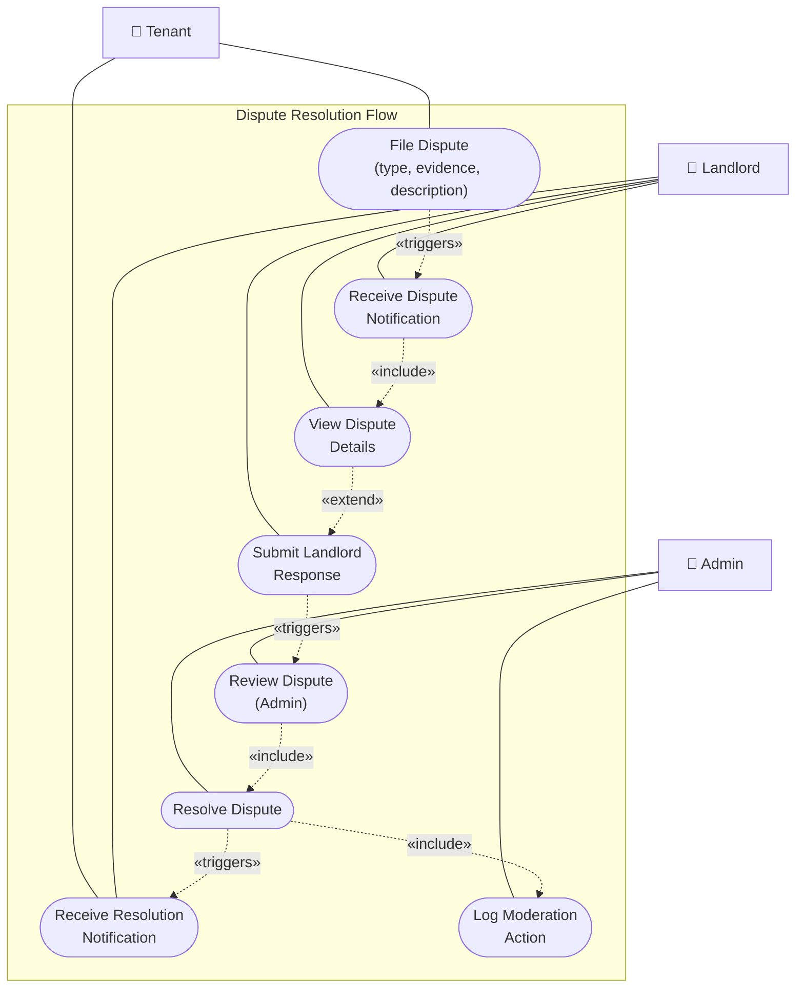
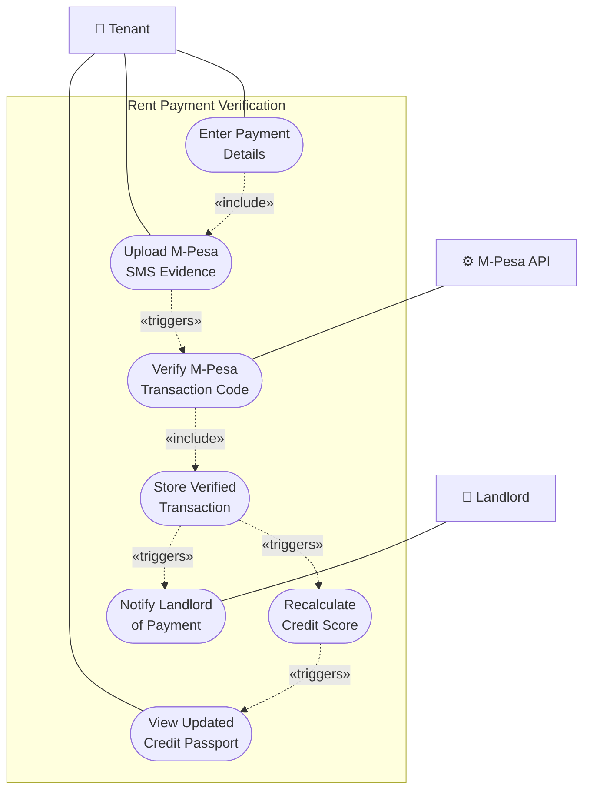

# TenCheck — Use Case Diagrams

Use case diagrams are rendered as Mermaid flowcharts.  
Conventions used:

- **Actor** — rectangle `[ ]` on the left/right edge  
- **Use Case** — stadium shape `([ ])` inside the system boundary  
- **`---`** — actor participates in use case  
- **`-.->|«include»|`** — mandatory inclusion  
- **`-.->|«extend»|`** — optional extension  

---

## 1. System Overview Use Case Diagram

High-level view of all actors and the feature areas they interact with.

---

## 2. Tenant Use Cases

---

## 3. Landlord Use Cases

---

## 4. Service Worker Use Cases

---

## 5. Admin Use Cases

---

## 6. Cross-Actor Use Case: Dispute Resolution

Shows all actors involved in the full dispute lifecycle.

---

## 7. Cross-Actor Use Case: Rent Payment Verification

Shows the tenant, M-Pesa, and the system collaborating on payment verification.

---

## Use Case Count Summary

| Actor | Total Use Cases |
|---|---|
| Tenant | 28 |
| Landlord | 22 |
| Service Worker | 13 |
| Admin | 14 |
| **Total unique** | **~50** |
